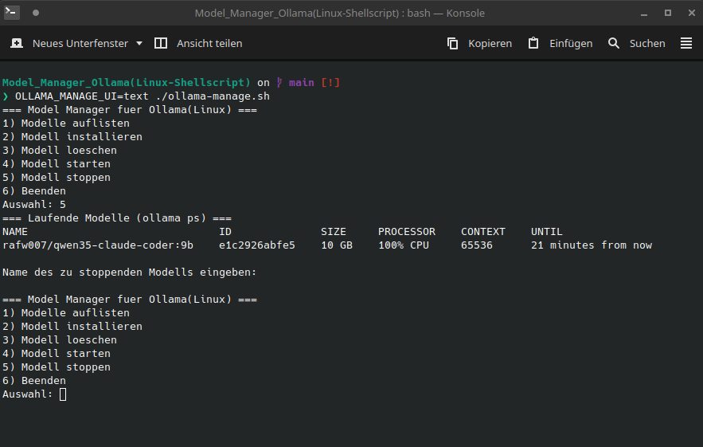
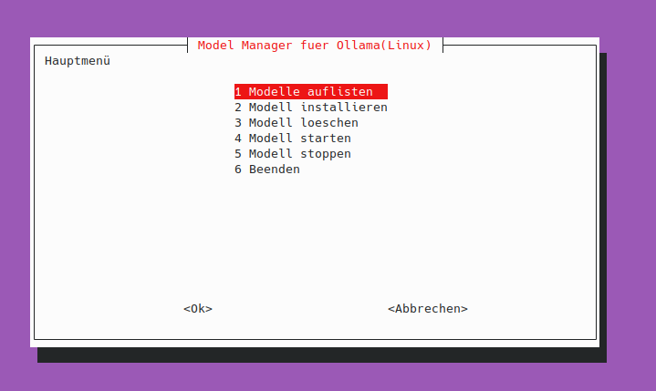
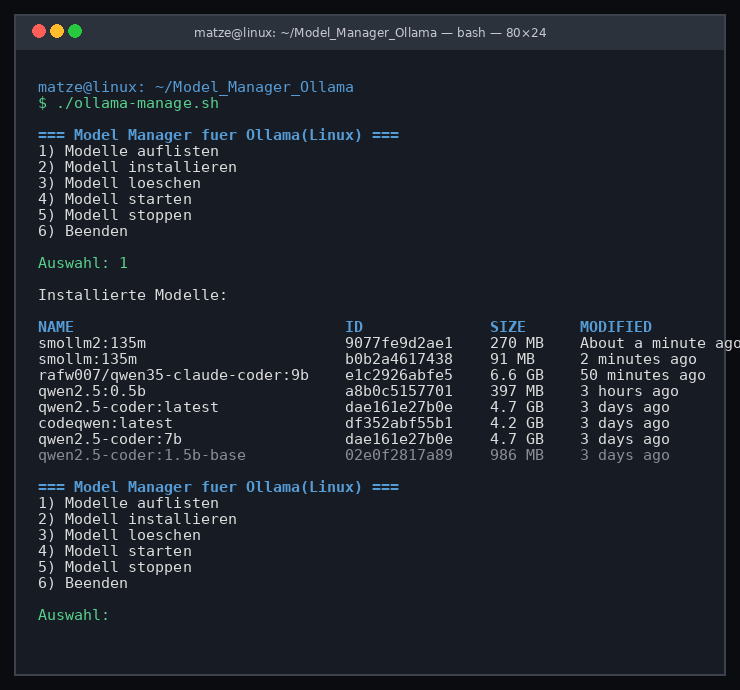

# Model Manager für Ollama

Ein kleines Shell-Projekt zur komfortablen Verwaltung von [Ollama](https://ollama.com)-Modellen direkt im Terminal – über ein interaktives Menü.

## Features

- **Modelle auflisten** – alle lokal installierten Modelle anzeigen
- **Modelle installieren** – Modelle per `ollama pull` aus der Registry herunterladen
- **Modelle löschen** – lokale Modelle per `ollama rm` entfernen
- **Modelle starten** – interaktiv per `ollama run` nutzen
- **Modelle stoppen** – laufende Modelle per Ollama-HTTP-API beenden (`keep_alive: 0`)
- **Interaktive Modellauswahl** – erkennt automatisch `fzf`, `whiptail` oder fällt auf eine numerische Texteingabe zurück
- **Wahl zwischen Text- und Dialogmenü** – automatische Auswahl oder per Umgebungsvariable `OLLAMA_MANAGE_UI` steuerbar
- **Testmodelle installieren** – per Zusatzskript `modelleZumTestenInstall.sh`

## Enthaltene Skripte

| Skript | Beschreibung |
|---|---|
| `ollama-manage.sh` | Interaktives Werkzeug zum Auflisten, Installieren, Starten, Stoppen und Entfernen von Modellen |
| `modelleZumTestenInstall.sh` | Installiert eine kleine Auswahl an Modellen für Test- und Demo-Setups |

## Projektstruktur

```
├── ollama-manage.sh              # Hauptskript (Verwaltung)
├── modelleZumTestenInstall.sh    # Testmodelle herunterladen
├── LICENSE                       # MIT-Lizenz
├── README.md                     # Diese Dokumentation
└── Beispielbild/
    └── ollama-manage-beispiel.png
```

## Voraussetzungen

- Linux oder ein anderes System mit Bash
- [`ollama`](https://ollama.com/download) muss installiert und im `PATH` verfügbar sein

### Optionale Abhängigkeiten

| Tool | Zweck |
|---|---|
| `fzf` | Komfortable, durchsuchbare Modellauswahl (wird bevorzugt verwendet) |
| `whiptail` | Terminal-Menü mit grafischen Dialogen (z. B. Paket `whiptail` bzw. `newt` auf Debian/Ubuntu) |

> **Hinweis:** Ist weder `fzf` noch `whiptail` vorhanden, wird automatisch auf eine einfache numerische Texteingabe zur Modellauswahl zurückgegriffen.

## Nutzung

Zuerst das Skript ausführbar machen (falls noch nicht geschehen):

```bash
chmod +x ollama-manage.sh modelleZumTestenInstall.sh
```

### Interaktives Menü starten

```bash
./ollama-manage.sh
```

Das Skript prüft beim Start, ob `ollama` installiert und erreichbar ist. Anschließend wird das interaktive Menü angezeigt.

### Menüpunkte

| Textmenü | whiptail-Dialog | Funktion |
|---|---|---|
| 1) Modelle auflisten | Modelle auflisten | Zeigt alle lokal installierten Modelle |
| 2) Modell installieren | Modell installieren | Lädt ein Modell herunter (`ollama pull`) |
| 3) Modell löschen | Modell löschen | Entfernt ein ausgewähltes Modell (`ollama rm`) |
| 4) Modell starten | Modell starten | Startet ein ausgewähltes Modell interaktiv (`ollama run`) |
| 5) Modell stoppen | Modell stoppen | Stoppt ein laufendes Modell über die Ollama-HTTP-API (`keep_alive: 0`) |
| 6) Beenden | Beenden | Beendet das Skript |

### Auswahl des Menüs

- **Standard (empfohlen):** Ohne weitere Einstellungen erkennt das Skript automatisch, ob `whiptail` installiert ist und das Terminal interaktiv ist – dann erscheint das whiptail-Dialogmenü, andernfalls das Textmenü.
- **Per Umgebungsvariable erzwingen:**

```bash
OLLAMA_MANAGE_UI=whiptail ./ollama-manage.sh   # whiptail-Dialoge erzwingen
OLLAMA_MANAGE_UI=text ./ollama-manage.sh       # Textmenü erzwingen
```

Mit `OLLAMA_MANAGE_UI=whiptail` wird das Dialogmenü nur dann verwendet, wenn `whiptail` installiert ist **und** das Skript in einem interaktiven Terminal (tty) läuft. Ist das nicht der Fall, erscheint eine Warnung und das Skript fällt auf das Textmenü zurück. Mit `OLLAMA_MANAGE_UI=text` wird immer das Textmenü verwendet.

### Modellauswahl im Menü

- **`fzf`** – durchsuchbare, komfortable Modellauswahl (wird bevorzugt, falls installiert)
- **`whiptail`** – Auswahl über einen Terminal-Dialog
- **einfache Texteingabe** – zeigt die verfügbaren Modelle nummeriert an; die **Nummer** oder der Modellname kann eingegeben werden

### Testmodelle installieren

Das zweite Skript lädt bei jedem Aufruf eine kleine Auswahl an Modellen für Tests und Demos in den Ollama-Cache. Es prüft dabei wie das Hauptskript, dass `ollama` installiert und der Daemon erreichbar ist:

```bash
./modelleZumTestenInstall.sh
```

## Beispielmodelle

Das Install-Skript lädt derzeit diese Modelle:

- `smollm:135m`
- `smollm2:135m`
- `smollm2:360m`
- `qwen2.5:0.5b`

> **Hinweis:** `llama3.2:1b` ist im Skript auskommentiert und wird nur heruntergeladen, wenn du die Auskommentierung entfernst. Die kommentierten `ollama run`-Zeilen zeigen, wie du die Modelle nach dem Download manuell separat starten kannst.

## Fehlerbehandlung

- Ist `ollama` nicht installiert oder nicht im `PATH`, bricht das Skript sauber mit einer Fehlermeldung ab.
- Ist `ollama` zwar installiert, aber der Daemon nicht erreichbar, bricht das Skript ebenfalls sauber mit einem Hinweis ab (z. B. `ollama serve` starten).
- Wird ein Modellname falsch geschrieben oder das Modell ist nicht verfügbar, zeigt Ollama eine entsprechende Fehlermeldung an.
- Alle Aktionen kümmern sich um leere/fehlende Angaben und brechen dann sauber ab.

## Beispielbilder

Hier sind Screenshots des Skripts in verschiedenen Modi:

### Textmenü (Standard ohne fzf/whiptail)



### whiptail-Dialog (grafisches Menü)



### Textmenü mit Modellauflistung



## Hinweise

- **Speicherplatz:** Modelle können je nach Größe mehrere Gigabyte Speicherplatz beanspruchen.
- **Netzwerk:** `ollama pull` benötigt eine funktionierende Internetverbindung zum Download.
- Das Skript bringt `set -euo pipefail` in der ersten Zeile – Befehle, die fehlschlagen, führen zum Abbruch des Skripts.
- Falls `fzf` installiert ist, wird es für die Modellauswahl bevorzugt; andernfalls `whiptail` (sofern verfügbar) oder eine numerische Texteingabe.

## Lizenz

Dieses Projekt ist unter der **MIT-Lizenz** lizenziert – siehe [LICENSE](LICENSE).

Copyright (c) 2026 Matthias Post# matzetau70-Scripte_BashShellCLI
