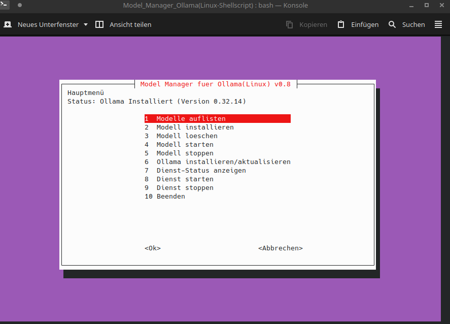
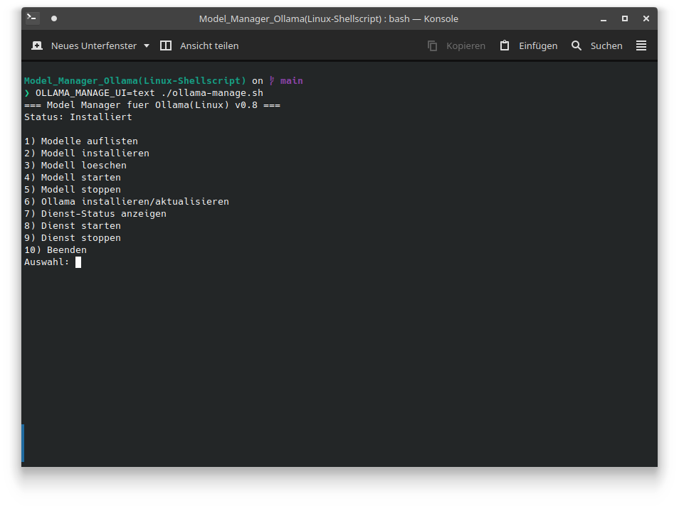

# Model Manager für Ollama (Linux)

Ein Bash-Skript zur Verwaltung von Ollama-Modellen auf Linux-Systemen. Bietet eine grafische Oberfläche (Whiptail) sowie einen Text-Modus für die Verwaltung von Modellen, Diensten und Installationen.





## 📋 Funktionen

| Nr. | Funktion | Beschreibung |
| ----- | ---------- | -------------- |
| 1 | **Modelle auflisten** | Zeigt alle lokal installierten Ollama-Modelle an |
| 2 | **Modell installieren** | Lädt ein Modell von Ollama herunter (mit Fortschrittsanzeige im Whiptail-Modus) |
| 3 | **Modell löschen** | Entfernt ein Modell unwiderruflich von der Festplatte (mit Sicherheitsabfrage) |
| 4 | **Modell starten** | Startet eine interaktive Chat-Sitzung mit einem Modell |
| 5 | **Modell stoppen** | Entlädt ein Modell aus dem RAM/VRAM (via Ollama-API) |
| 6 | **Ollama installieren/aktualisieren** | Installiert oder aktualisiert Ollama über das offizielle Installationsskript |
| 7 | **Dienst-Status anzeigen** | Zeigt den Status des systemd-Dienstes an |
| 8 | **Dienst starten** | Startet den Ollama-Hintergrunddienst |
| 9 | **Dienst stoppen** | Stoppt den Ollama-Hintergrunddienst |
| 10 | **Beenden** | Beendet das Programm |

## 🚀 Installation

### Voraussetzungen

- **Linux** (mit systemd)
- **Bash** (≥ 4.0)
- **whiptail** (für den grafischen Modus, optional)
- **curl** (für die Installation)
- **Ollama** (wird automatisch erkannt, kann über Menüpunkt 6 installiert werden)

### Installation des Skripts

```bash
# Skript herunterladen oder kopieren
git clone https://github.com/matzetau70/matzetau70-Scripte_BashShellCLI.git
cd "Model_Manager_Ollama(Linux-Shellscript)"

# Ausführbar machen
chmod +x ollama-manage.sh
```

## ▶️ Verwendung

```bash
./ollama-manage.sh
```

### UI-Modus steuern

Das Skript wählt automatisch den passenden Modus:

| Modus | Beschreibung |
| ------- | -------------- |
| **auto** (Standard) | Nutzt Whiptail, wenn ein Terminal und whiptail verfügbar sind, sonst Text-Modus |
| **text** | Erzwingt den Text-Modus |
| **whiptail** | Erzwingt den Whiptail-Modus |

```bash
# Text-Modus erzwingen
OLLAMA_MANAGE_UI=text ./ollama-manage.sh

# Whiptail-Modus erzwingen
OLLAMA_MANAGE_UI=whiptail ./ollama-manage.sh
```

## 🧪 Tests

Das Projekt enthält ein umfassendes Testskript:

```bash
bash tests/test_ollama_manage.sh
```

Das Testskript testet alle 10 Menüpunkte in beiden UI-Modi sowie Fehlerfälle (Ollama nicht installiert, Daemon nicht erreichbar, Dienst nicht gestartet, Dienst existiert nicht).

## 📁 Projektstruktur

``` text
├── ollama-manage.sh          # Hauptskript
├── ollama-manage.png         # Screenshot (Whiptail-Modus)
├── ollama-manage-text.png    # Screenshot (Text-Modus)
├── tests/
│   ├── test_ollama_manage.sh # Testskript
│   └── fakebin/              # Fake-Binaries für Tests (ignoriert)
├── .gitignore
└── README.md
```

## 🛠️ Technische Details

- **Sprache:** Bash
- **GUI:** Whiptail (Dialogboxen)
- **Modellverwaltung:** `ollama list`, `ollama pull`, `ollama rm`, `ollama run`, `ollama ps`
- **Dienstverwaltung:** `systemctl` (start, stop, status)
- **Modell stoppen:** Ollama-API (`POST /api/generate` mit `keep_alive: 0`)
- **Installation:** Offizielles Ollama-Installationsskript (`https://ollama.com/install.sh`)

## 📄 Lizenz

Dieses Projekt ist unter der MIT-Lizenz veröffentlicht. Weitere Informationen finden Sie in der Datei `LICENSE` (falls vorhanden).

## 👤 Autor

- **GitHub:** [matzetau70](https://github.com/matzetau70)
